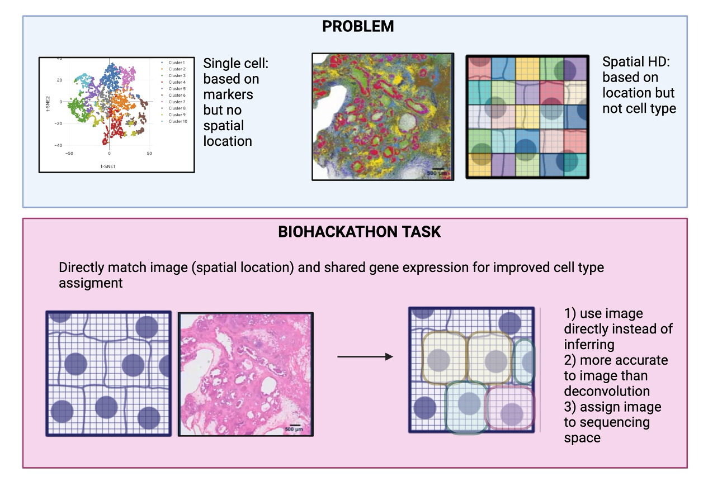
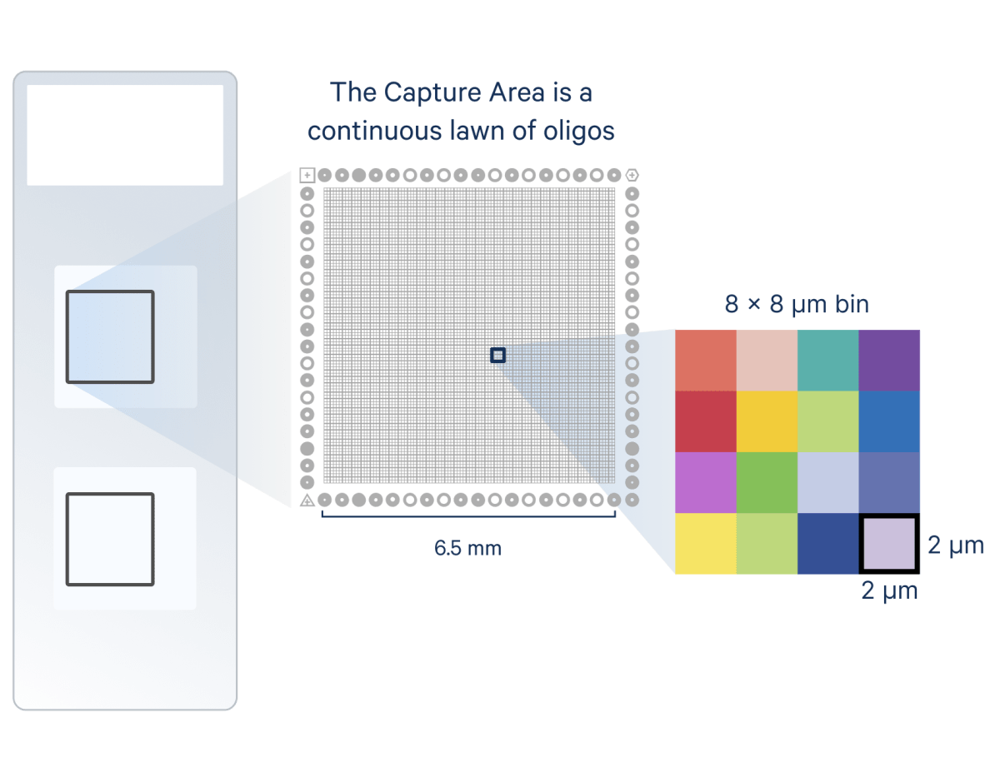

# KIDS24-team6

Center of Spatial Omics

Team members:
    Yutian Liu, Maycon Marcao, Felipe Pimenta Carcanholo

## Project

**SpixelMap**: Advancing Spatial Omics Insights through pixel-based Grid Classification Mapping and Analysis 

### Keywords

Spatialomics, Visium HD, Grids, H&E Pathology Image, Pixel, Mapping, Gene Expression

#### Dataset

- Dataset :[Public data Human CRC Visium HD Download from 10x](https://www.10xgenomics.com/datasets/visium-hd-cytassist-gene-expression-libraries-of-human-crc)
- Input: H&E tif image [Download from GitHUb](https://github.com/stjude-biohackathon/KIDS24-team6/blob/main/Data/tissue_hires_image.tiff)

### 

